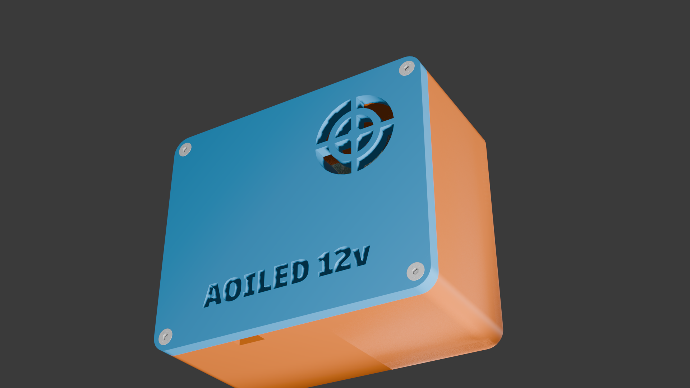
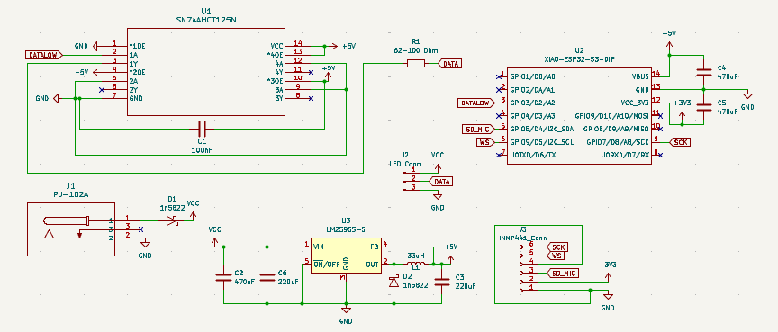
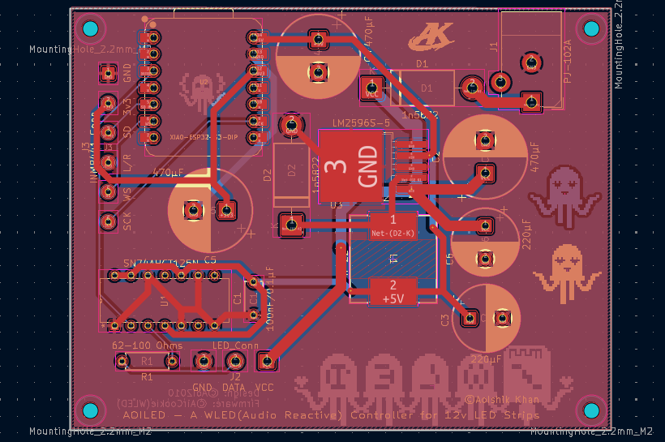
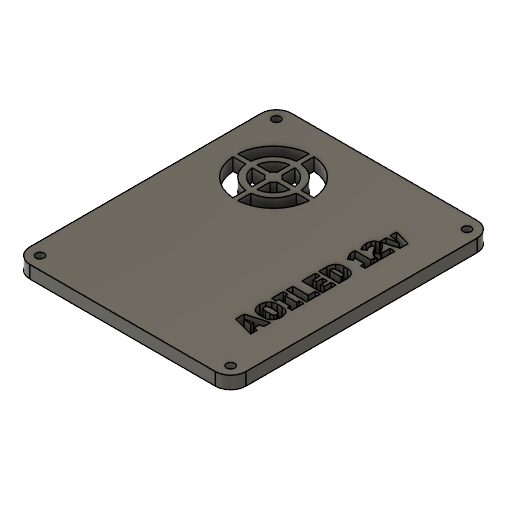
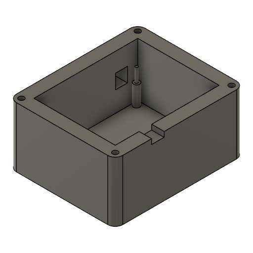
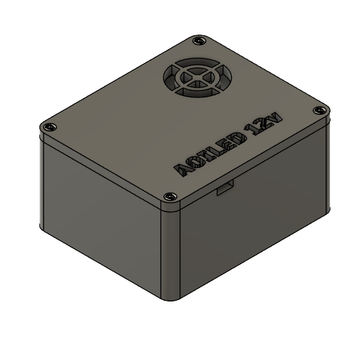

# AOILED
A WLED(Audio Reactive) Based LED Strips Controller for 12v LED Strips

### Inspiration

I wanted to create a LED strip controller that could be used to control 12v WS2811 LED strips. It also supports audio based effects using WLED'S Audio Reactive Mode. I wanted to use and test the WLED Firmware also.

### Challenges

Believe it or not, this was my third time using Fusion 360 and KiCad! I watched numerous tutorials and guides and did a lot of googling, but in the end, I'm pretty proud of the final product. I had the most struggle figuring out the tolerances and dimensions. Also in KiCad, I had a lot of trouble with footprints and making sure everything was aligned properly and the traces were correct(but it became a little long traces and some may not look good).

### How To Use This
- STEP 1: Buy all the things listed in the BOM, print the case and also order the PCB.
- STEP 2: Flash [WLED](https://kno.wled.ge/) to the XIAO.
- STEP 3: Solder the components to the PCB and assemble the case.
- STEP 4: Use a 12v DC Power Supply to power the PCB and connect the LED strip to the PCB.
- STEP 5: Install the WLED App on your phone and connect to the WLED Network(WLED-AP) and configure it to connect to your WiFi Network and change the type of LEDs in the settings.
- STEP 6: Do Anything With It and have fun!
Thank You! Also Please give a star to this poor fellow if you like the project. Thank You Again!

### Specifications

BOM (from `BOM.csv`):
###### Some of the products in the BOM are more than required because Robu doesnot allow products to be bought under Rs. 10. Thank You For Understanding.

| Name | Qty | Purpose | Link | Distributor |
|---|---:|---|---|---|
| JST SM 3pin Male | 1 | For connecting the LED Strips | [Buy](https://quartzcomponents.com/products/jst-sm-3-pin-connector-male) | Quartz Components |
| JST SM 3pin Female | 1 | For connecting the LED Strips | [Buy](https://quartzcomponents.com/products/jst-sm-3-pin-2517-2518-connector-male-female-1-pair) | Quartz Components |
| 24AWG High Voltage Silicone Wire 3000V - Red | 1 | Connecting the INMP441 to the PCB | [Buy](https://robu.in/product/24awg-high-voltage-silicone-wire-3000v-red/) | Robu |
| PCB | 1 | 2-layers PCB | [Buy](https://jlcpcb.com) | JLCPCB |
| 3d Printing of Case Shipping | 1 | For the Case Shipping Charges by Souptik Samanta | [Reference](https://app.slack.com/client/E09V59WQY1E/C095YP8GLKT) | Souptik Samanta via Printing Legion |
| WS2811 Neopixel LED Strip 60LED/MTR - 12V Addressable LED Strip (5 Meter Pack) | 1 | LED | [Buy](https://quartzcomponents.com/products/led-strip-ws2811-non-waterproof-60led-mtr?variant=43998632804586&country=IN&currency=INR&utm_medium=product_sync&utm_source=google&utm_content=sag_organic&utm_campaign=sag_organic?utm_source=google&utm_medium=FreeListings&gad_source=1&gad_campaignid=20505738210&gbraid=0AAAAACPPFdO-RsbPQEnSoftWjFAWjTe6_&gclid=Cj0KCQjwkYLPBhC3ARIsAIyHi3SfTPIEVRr-BIY-_0PvQc8F5C1hPgOFEIkoqv-DdNr_KikiOU2QIBoaArzWEALw_wcB) | Quartz Components |
| 24AWG High Quality Ultra Flexible Silicone Wire - Yellow | 2 | Connecting the INMP441 to the PCB | [Buy](https://robu.in/product/high-quality-ultra-flexible-24awg-silicone-wire-yellow/) | Robu |
| 24AWG High Quality Ultra Flexible Silicone Wire - Blue | 2 | Connecting the INMP441 to the PCB | [Buy](https://robu.in/product/high-quality-ultra-flexible-24awg-silicone-wire-1000m-blue/) | Robu |
| M3 X 25mm Hex (Allen) CSK SS 304 Screw (Dia. 3mm, Length 25mm) | 4 | Screws | [Buy](https://onlyscrews.in/products/m3-x-25mm-hex-allen-csk-ss-304-screw?variant=49181133799737) | OnlyScrews |
| M3 X 6mm Brass Threaded Inserts (Dia. 3mm, Length 6mm) | 4 | Screws Inserts | [Buy](https://onlyscrews.in/products/m3-x-6mm-brass-threaded-inserts?variant=49418769203513) | OnlyScrews |
| SN74AHCT125N | 1 | Level Shifting of Data | [Buy](https://robu.in/product/sn74ahct125n-texas-instruments-8ma-1-4-5v5-5v-8ma-4-dip-14-buffers-drivers-receivers-transceivers-rohs/) | Robu |
| 68 ohms resistor | 44 | Resistance | [Buy](https://robu.in/product/68-ohm-0-25w-metal-film-resistor-pack-of-100/) | Robu |
| XIAO ESP32S3 | 1 | MCU | [Buy](https://robocraze.com/products/seeed-studio-xiao-esp32-s3-development-board-supports-wi-fi-bluetooth-5-0?_pos=2&_psq=seeed&_ss=e&_v=1.0) | RoboCraze |
| INMP441 I2S Microphone | 1 | For Audio | [Buy](https://robocraze.com/products/inmp441-mems-high-precision-omnidirectional-microphone-module-i2s?variant=44013298778336&country=IN&currency=INR&utm_medium=product_sync&utm_source=google&utm_content=sag_organic&utm_campaign=sag_organic&utm_source=google&utm_medium=cpc&utm_campaign=BL+%7C+Pmax+%7C+Feed+Only+%7C+RoboCraze+%7C+Electronic+Components+%7C+31%2F05&utm_source=googleads&utm_medium=ppc&utm_campaign=21337209786&utm_content=_&utm_term=&campaignid=21337209786&adgroupid=&campaign=21337209786&gad_source=1&gad_campaignid=21343423652&gbraid=0AAAAADgHQvbxasRZUxOiQZXifpMMypWUJ&gclid=Cj0KCQjwkYLPBhC3ARIsAIyHi3QcPoxT8zFgw-EHv9DycpeCdUBRzYf57K5qU6GTAVpEpT5dH_MCyzYaAsCvEALw_wcB) | Robo Craze |
| 1n5822 Diode | 2 | Diode | [Buy](http://robu.in/product/1n5822-mdd-40v-525mv3a-3a-do-201ad-schottky-diodes-rohs/) | Robu |
| LM2596S-5.0 | 1 | Step Down Voltage | [Buy](https://robu.in/product/lm2596s-5-0-xblw-step-down-type-fixed-5v-to-263-5l-dc-dc-converters-rohs/) | Robu |
| SRR1208-330YL-BOURNS-2.8A 33uH +/-15% 3.8A SMD, 12.7x12.7mm Power Inductor | 1 | 12v to 5v | [Buy](https://robu.in/product/srr1208-330yl-bourns-2-8a-33uh-%C2%B115-3-8a-smd12-7x12-7mm-power-inductors-rohs/) | Robu |
| Nichicon-220uF 50V | 2 | Decoupling | [Buy](https://robu.in/product/uhe1h221mpd-nichicon-220uf-50v-84m%cf%89100khz-%c2%b120-1-05a100khz-plugind10xl16mm-aluminum-electrolytic-capacitors-leaded-rohs/) | Robu |
| Nichicon 470uf 50v | 3 | Decoupling | [Buy](https://robu.in/product/uhe1h471mhd6-nichicon-470uf-50v-45m%cf%89100khz-%c2%b120-1-66a100khz-plugind12-5xl20mm-aluminum-electrolytic-capacitors-leaded-rohs/) | Robu |
| 100nf Disc Capacitor | 8 | Decoupling | [Buy](https://robu.in/product/100nf-50v-disc-capacitor/) | Robu |
| PJ-102A | 2 | 12v Power Input (QTY is 2 because minimum order quantity is 2) | [Buy](https://www.lioncircuits.com/parts/PJ-102A) | Lion Circuits |

Others:
- WLED Firmware
- PCB Gerber Files
- Case STL files for 3D printing

Schematic | PCB Layout |
:-------------------------:|:-------------------------:|
 |  |

 Case Top | Case Bottom |
:-------------------------:|:-------------------------:|
  | 

 

Assembled Case |
:-------------------------:|
 |

### Notes
The firmeare I used is WLED. It is a premade firmare by Aircoookie and it is open source. Here is the link to it: [Github](https://github.com/wled/WLED) | [Wiki](https://kno.wled.ge/) | [Flasher(Official)](https://install.wled.me/) | [Flasher(Third Party)](https://wled-install.github.io/)

Thank You for Understanding.

## Thanks For Reading! Also leave a star if you like the project! ⭐

